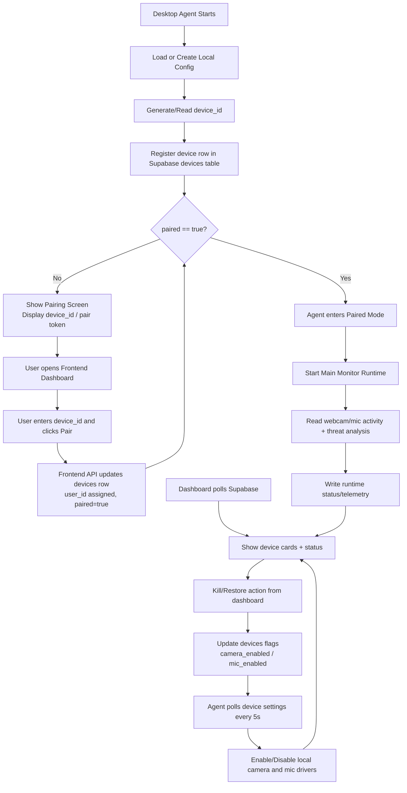

# Fugenhack Project Flowchart

Simple modular view of how the system works end-to-end.

## High-Level Modules
- Frontend Dashboard (pairing + control UI)
- Backend Desktop Agent (pairing screen + runtime monitor)
- Supabase Database (users, devices, device_status)

## System Flow (General)

## Data Responsibilities
- users: Login and ownership data
- devices: Pairing state and control flags
- device_status: Live metrics (cpu, ram, disk, camera_app, mic_app, threat_score)

## Runtime Notes
- Pairing gate blocks main monitor until paired=true
- Dashboard actions modify cloud flags
- Agent sync loop enforces cloud flags on local hardware
